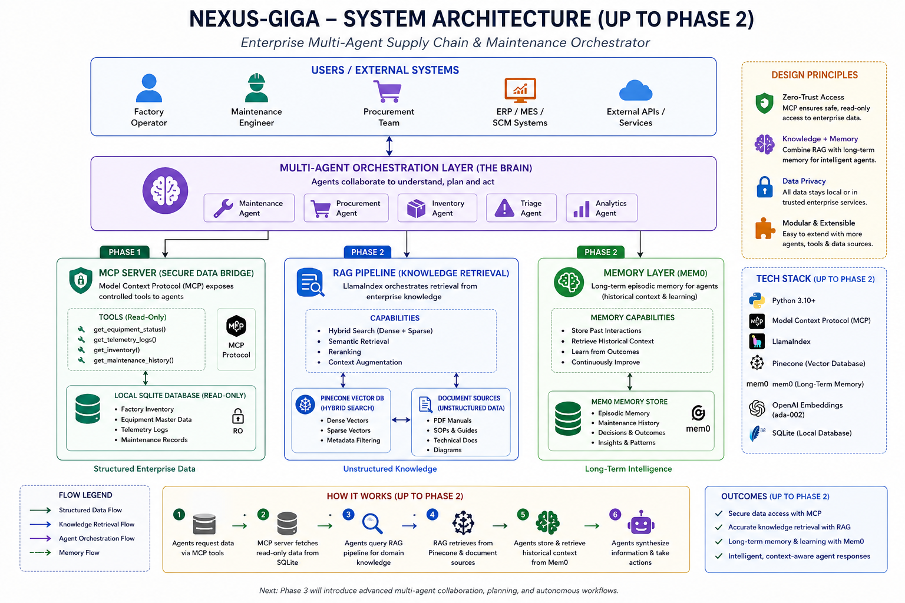
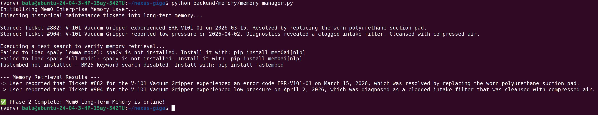
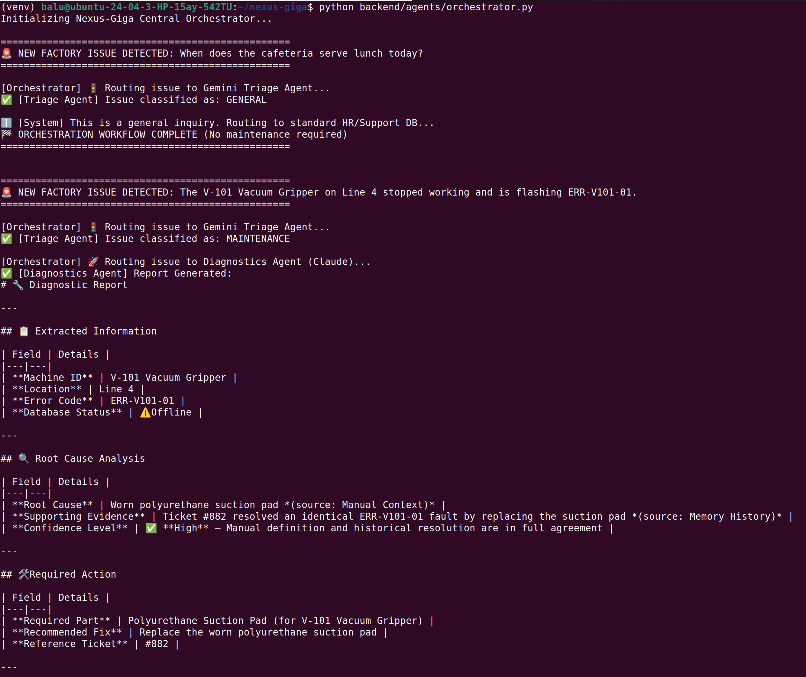
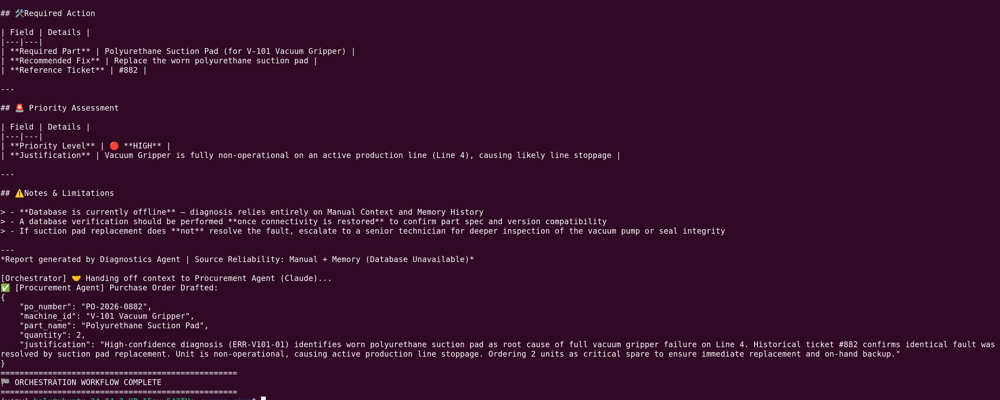

# 🏭 Nexus-Giga

## Enterprise Multi-Agent Supply Chain & Maintenance Orchestrator

[](https://www.python.org/downloads/)
[](https://modelcontextprotocol.io/)
[](https://www.pinecone.io/)
[](https://openai.com/)
[](https://opensource.org/licenses/MIT)



### 📖 Overview

Nexus-Giga is an autonomous, multi-agent ecosystem designed for industrial giga-factories. It bridges the critical gap between unstructured technical knowledge (PDF equipment manuals) and structured enterprise data (telemetry, SQL databases) to fully automate the equipment maintenance and procurement lifecycle.

By leveraging Agentic RAG, Enterprise Long-Term Memory (Mem0), and the Model Context Protocol (MCP), Nexus-Giga ensures secure, localized data processing while granting cloud agents the context they need to perform autonomous factory triage.

### 📊 Project Roadmap & Status

* [x] **Phase 1: The Secure Data Bridge** (Complete)

* [x] **Phase 2: Enterprise Knowledge & Memory** (Complete)

* [x] **Phase 3: The Multi-Agent Brain** (Complete)

* [ ] **Phase 4: Streaming & UX** (Upnext)

* [ ] **Phase 5: Evaluation & Production**

### 🏗️ Architecture & Tech Stack

#### Phase 1: The Secure Data Bridge

* **Database:** SQLite

* **Protocol:** FastMCP (Model Context Protocol)

* **Security:** Strict read-only (`mode=ro`) SQLite connections to prevent LLM hallucinations from corrupting localized databases.

#### Phase 2: Enterprise Knowledge & Memory
  
* **Vector Database:** Pinecone (Configured for Hybrid Search: Dense + Sparse vectors)

* **Embeddings:** OpenAI `text-embedding-ada-002` (1536 dimensions)

* **RAG Orchestration:** LlamaIndex

* **Long-Term Memory:** Mem0 (Powered by OpenAI `gpt-4o-mini` for historical episodic memory retrieval)

#### Phase 3: The Multi-Agent Brain

* **Triage & Roting:** `Gemini 3 Flash Preview` (High-speed issue classification)
  
* **Diagnostics & Procurement Agents:** Anthropic `Claude Sonnet 4.6` (Complex reasoning & Agent-to-Agent handoffs)

* **Structured Output:** Pydantic (Enforcing strict JSON schemas for Purchase Orders)

### 📂 Repository Structure

```text
nexus-giga/
├── assets/
│   └── images/                    # Architecture diagrams and execution proofs
│       ├── mcp-success.png
│       ├── memory-success.png
│       └── Nexus-Giga-architecture.png
├── backend/
│   ├── agents/
│   │   ├── diagnostics.py         # Diagnostics Agent (Claude Sonnet 4.6)
│   │   └── orchestrator.py        # Multi-Agent Brain (Gemini Triage ( Gemini 3 Flash Preview ) + Claude A2A)
│   ├── mcp/
│   │   └── mcp_server.py          # Secure Model Context Protocol Server
│   ├── memory/
│   │   └── memory_manager.py      # Mem0 Long-Term Agent Memory Initialization
│   └── rag/
│       └── ingest.py              # LlamaIndex Hybrid Search PDF Ingestion
├── data/
│   ├── factory_inventory.db       # Local SQLite Enterprise Database
│   └── V-101_Vacuum_Gripper_Manual.pdf # Synthetic Equipment Manual
├── generate_pdf.py                # PDF Mock Data Generator
├── init_db.py                     # Database bootstrapping script
├── LICENSE                        # MIT License
├── README.md                      # Project documentation
└── requirements.txt               # Project dependencies
```

### 🚀 Getting Started

`Prerequisites`

* Python 3.10 or higher

* Node.js (v18+) & npm (required for the MCP Inspector testing UI)

* Active API Keys for OpenAI and Pinecone

`Installation`

1. Clone the repository:

```bash
git clone [https://github.com/your-username/nexus-giga.git](https://github.com/your-username/nexus-giga.git)
cd nexus-giga
```

2. Set up the virtual environment:

```bash
python3 -m venv venv
source venv/bin/activate # On Windows use: venv\Scripts\activate
```

3. Install dependencies:

```bash
pip install -r requirements.txt
```

4. Configure Environment Variables:

Create a .env file in the root directory and add your API keys:

```text
PINECONE_API_KEY="your-pinecone-key"
OPENAI_API_KEY="your-openai-key"
ANTHROPIC_API_KEY="your-anthropic-key"
```

### ⚙️ Execution

#### Phase 1: Local Data Bridge

1. Initialize the Mock Enterprise Database:

Populates the `data/` directory with mock factory equipment and telemetry logs.

```bash
python init_db.py
```

2. Run the MCP Server (Interactive Testing):

Launch the local MCP Inspector to simulate an LLM querying the data bridge.

```bash
npx @modelcontextprotocol/inspector python backend/mcp/mcp_server.py
```


#### Phase 2: RAG & Memory Pipeline

1. Generate the synthetic technical manual:

```bash
python generate_pdf.py
```

2. Chunk, embed, and upsert the manual to Pinecone:

```bash
python backend/rag/ingest.py
```

3. Initialize the Mem0 historical maintenance database:

```bash
python backend/memory/memory_manager.py
```



#### Phase 3:The Multi-Agent Brain

Execute the cental orchestrator to witness the Agent-to-Agent (A2A) handoff in the terminal:

```bash
python backend/agents/orchestrator.py
```





### 🛡️ Security & Privacy

This application is designed with enterprise zero-trust principles. The MCP server acts as an isolation layer. Language models are only provided explicitly defined tools (e.g., `get_equipment_status`) and cannot execute arbitrary SQL queries against the local datastore.

### 📄 License

This project is licensed under the MIT License - see the LICENSE file for details.
