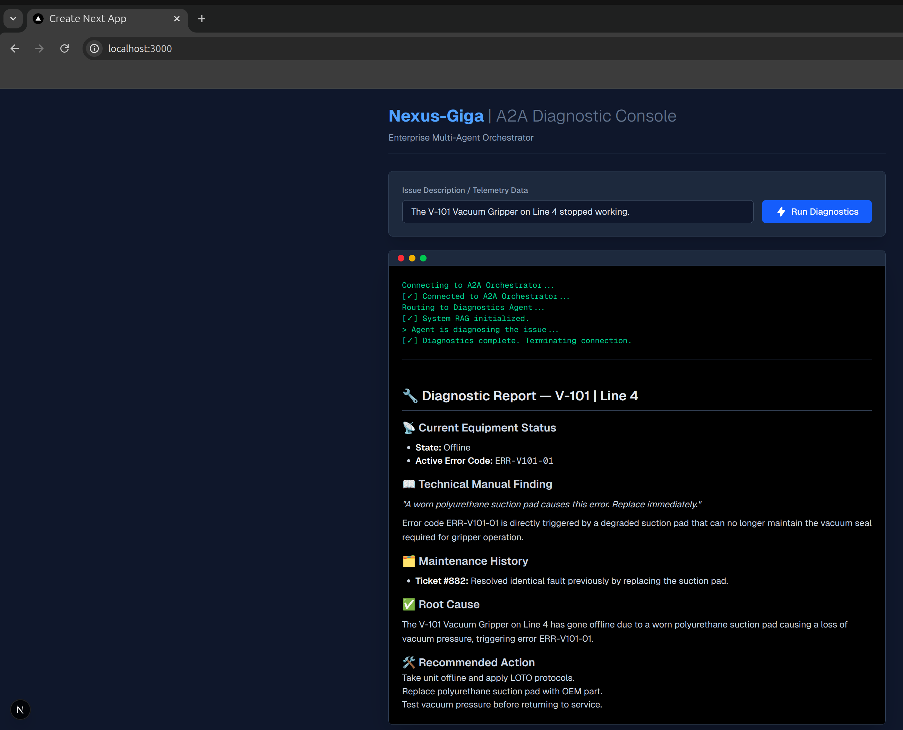

# 🏭 Nexus-Giga

## Enterprise Multi-Agent Supply Chain & Maintenance Orchestrator

[](https://www.python.org/downloads/)
[](https://modelcontextprotocol.io/)
[](https://www.pinecone.io/)
[](https://openai.com/)
[](https://www.anthropic.com/)
[](https://gemini.google.com/)
[](https://nextjs.org/)
[](https://opensource.org/licenses/MIT)
[](https://www.docker.com/)

### 📖 Overview

Nexus-Giga is an autonomous, multi-agent ecosystem designed for industrial giga-factories. It bridges the critical gap between unstructured technical knowledge (PDF equipment manuals) and structured enterprise data (telemetry, SQL databases) to fully automate the equipment maintenance and procurement lifecycle.

By leveraging Agentic RAG, Enterprise Long-Term Memory (Mem0), and the Model Context Protocol (MCP), Nexus-Giga ensures secure, localized data processing while granting cloud agents the context they need to perform autonomous factory triage.

### 📊 Project Roadmap & Status

- **[x] Phase 1: The Secure Data Bridge** (Complete)

- **[x] Phase 2: Enterprise Knowledge & Memory** (Complete)

- **[x] Phase 3: The Multi-Agent Brain** (Complete)

- **[x] Phase 4: Streaming & UX** (Complete)

- **[x] Phase 5: Evaluation & Observability** (Complete)

- **[x] Phase 6: Hybrid Containerization & Production** (Complete)

- **[ ] Phase 7: GCP Cloud Deployment (Up Next)**

### 🏗️ Architecture & Tech Stack

#### Phase 1 to 5: Core Brain & Data

- **Vector Database:** Pinecone (Configured for Hybrid Search: Dense + Sparse vectors)

- **Protocol:** FastMCP (Strict read-only SQLite connections to prevent DB hallucinations)

- **RAG & Memory:** LlamaIndex & Mem0

- **Orchestration & Reasoning:** Google ADK running Anthropic Claude Sonnet 4.6

- **API Bridge:** FastAPI (Port 5000) utilizing Server-Sent Events (SSE)

- **Observability:** Ragas & LangSmith

#### Phase 6: Enterprise Hybrid Architecture

To securely handle private enterprise packages (`a2a`, `google-adk`) while maintaining a cloud-ready UI, the system utilizes a hybrid local/containerized architecture:

- **The Backend (Native via** `uv`): The Python orchestrator and API bridge run natively to bypass Docker registry restrictions on private SDKs. Dependency management is handled blazingly fast via Astral's `uv`.

- **The Frontend (Docker):** The Next.js React console is containerized using a multi-stage Docker build, utilizing Next.js `standalone` mode to shrink the production image from 1.6GB down to ~187MB.

### 📂 Repository Structure

```text
📦 nexus-giga
├── 📂 assets                 # Static assets for documentation
│   └── 🖼️ images             # Execution screenshots and architecture diagrams
├── ⚙️ backend                # Core Python application logic
│   ├── 🌐 api                # Multi-agent orchestrator & API bridging
│   │   ├── 🐍 a2a_server.py  # Deterministic Google ADK Agent Server
│   │   └── 🐍 main.py        # FastAPI SSE Streaming Bridge
│   ├── 🔌 mcp                # Secure data integration layer
│   │   └── 🐍 mcp_server.py  # FastMCP bridge connecting LLMs to local DB
│   ├── 🧠 memory             # Stateful agent memory
│   │   └── 🐍 memory_manager.py
│   ├── 📚 rag                # Knowledge retrieval pipeline
│   │   └── 🐍 ingest.py      # Vectorization and database ingestion
│   └── 🧪 tests              # System validation & testing
│       ├── 🐍 evaluate_system.py
│       └── 🐍 test_a2a_client.py
├── 🗄️ data                   # Local databases and raw files
│   ├── 🗃️ factory_inventory.db
│   └── 📄 V-101_Vacuum_Gripper_Manual.pdf
├── 💻 frontend               # Next.js React Enterprise Console
│   ├── 🐳 Dockerfile         # Multi-stage optimized UI build
│   ├── 🌍 public             # Public static assets (SVGs, icons)
│   ├── ⚛️ src/app            # Next.js App Router components
│   │   ├── 🎨 globals.css
│   │   ├── 🧩 layout.tsx
│   │   └── 📄 page.tsx
│   └── 🛠️ configs            # UI settings (package.json, next.config.ts, etc.)
├── 📜 scripts                # Database and data bootstrapping utilities
│   ├── 🐍 generate_pdf.py    # Creates mock technical manuals
│   └── 🐍 init_db.py         # Seeds the SQLite database
├── 🐳 docker-compose.yml     # Container orchestration for the UI
├── 📦 pyproject.toml         # Python dependency configurations (uv)
├── 🔒 uv.lock                # Locked Python dependency resolution
├── 📖 README.md              # Main project documentation
└── ⚖️ LICENSE                # Open-source license terms
```

### 🚀 Getting Started

#### Prerequisites

- **Python 3.12+**

- **Docker Desktop / Engine** (Required for the Next.js UI)

- `uv` (The lightning-fast Python package manager)

```bash
curl -LsSf https://astral.sh/uv/install.sh | sh
```

#### Installation

**1. Clone the repository:**

```bash
git clone https://github.com/balakrishna-arigala26/nexus-giga.git
cd nexus-giga
```

**2. Install Python Dependencies (Backend):**

We use `uv` for dependency management. This single command will instantly read `pyproject.toml` and create a perfectly synced `.venv` environment natively.

```bash
uv sync
```

**3. Configure Environment Variables:**

Create a `.env` file in the root directory and add your API keys:

```text
PINECONE_API_KEY="your-pinecone-key"
OPENAI_API_KEY="your-openai-key"
ANTHROPIC_API_KEY="your-anthropic-key"
GOOGLE_API_KEY="your_gemini_api_key"
LANGCHAIN_API_KEY="your-langsmith-key"
LANGCHAIN_PROJECT="nexus-giga-production"
LANGCHAIN_TRACING_V2=true
```

### ⚙️ Execution

#### Bootstrapping Data (First-Time Setup)

**Initialize the Mock Database & PDF Knowledge:**

```bash
uv run scripts/init_db.py
uv run scripts/generate_pdf.py
uv run backend/rag/ingest.py
uv run backend/memory/memory_manager.py
```

**Running the Production Architecture:**

To bring the entire architecture online, you must boot the Docker frontend, plus **two active terminal windows** for the native backend components.

**1. Start the Dockerized Enterprise Console:**

This will build and deploy the optimized 187MB Next.js image.

```bash
docker compose up -d --build
```

**2. Start the AI Orchestrator (Terminal 1):**

```bash
uv run python backend/api/a2a_server.py
```

**3. Start the FastAPI SSE Bridge (Terminal 2):**

```bash
uv run python backend/api/main.py
```

**4. Run Diagnostics:**

Open your browser and navigate to `http://localhost:3000`. The diagnostic query is already pre-filled. Simply click **Run Diagnostics** to watch the multi-agent reasoning stream in real-time!



*Fig : Real-time diagnostic report streaming seamlessly into the Next.js UI, fully rendered via React-Markdown.*

### 🛡️ Security & Privacy

This application is designed with enterprise zero-trust principles. The MCP server acts as an isolation layer. Language models are only provided explicitly defined tools (e.g., `get_equipment_status`) and cannot execute arbitrary SQL queries against the local datastore. Private dependencies (`a2a`, `google-adk`) are protected via native host execution.

### 📄 License

This project is licensed under the MIT License - see the LICENSE file for details.
