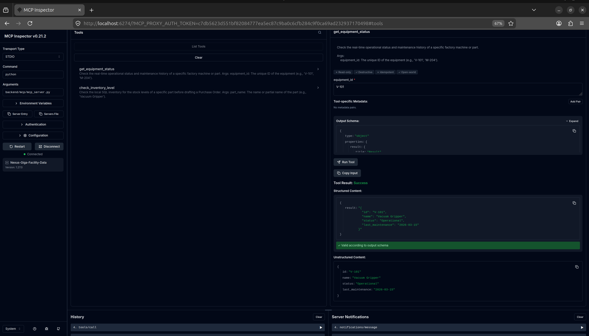

# 🏭 Nexus-Giga

## Enterprise Multi-Agent Supply Chain & Maintenance Orchestrator

[](https://www.python.org/downloads/)
[](https://modelcontextprotocol.io/)
[](https://www.sqlite.org/index.html)
[](https://opensource.org/licenses/MIT)

### 📖 Overview

Nexus-Giga is an autonomous, multi-agent ecosystem designed for industrial giga-factories. It bridges the critical gap between unstructured technical knowledge (PDF equipment manuals) and structured enterprise data (telemetry, SQL databases) to fully automate the equipment maintenance and procurement lifecycle.

By leveraging Agentic RAG and the Model Context Protocol (MCP), Nexus-Giga ensures secure, localized data processing without exposing raw database access to external LLMs.

### 📊 Project Roadmap & Status

* [x] **Phase 1: The Secure Data Bridge** (Complete)

* [ ] **Phase 2: Enterprise Knowledge & Memory** (Up Next)

* [ ] **Phase 3: The Multi-Agent Brain**

* [ ] **Phase 4: Streaming & UX**

* [ ] **Phase 5: Evaluation & Production**

### 🏗️ Architecture & Tech Stack (Phase 1)

Currently, this repository contains the foundational **Secure Data Bridge**.

* **Database:** SQLite

* **Data Protocol:** Model Context Protocol (MCP) using the official Python SDK

* **Security Guardrails:** Database connections are strictly enforced in `URI=True` and `mode=ro` (Read-Only) to prevent destructive LLM hallucinations.

* **Purpose:** Securely exposes local SQL inventory and telemetry data (e.g., equipment status, stock levels) to cloud-based LLM agents via standardized JSON-RPC tool calls.

### 📂 Repository Structure

```text
nexus-giga/
├── backend/
│   └── mcp/
│       └── mcp_server.py      # Core Model Context Protocol Server
├── data/
│   └── factory_inventory.db   # Local SQLite Database
├── init_db.py                 # Database bootstrapping script
├── .gitignore
└── README.md  
```

### 🚀 Getting Started

`Prerequisites`

* Python 3.10 or higher

* Node.js (v18+) & npm (required for the MCP Inspector testing UI)

`Installation`

`1. Clone the repository:`

```bash
git clone [https://github.com/your-username/nexus-giga.git](https://github.com/your-username/nexus-giga.git)
cd nexus-giga
```

`2. Set up the virtual environment:`

```bash
python3 -m venv venv
source venv/bin/activate # On Windows use: venv\Scripts\activate
```

`3. Install dependencies:`

```bash
pip install mcp
```

### Execution (Phase 1)

`1. Initialize the Mock Enterprise Database:`

Populates the `data/` directory with mock factory equipment and telemetry logs.

```bash
python init_db.py
```

`2. Run the MCP Server (Interactive Testing):`

Launch the local MCP Inspector to simulate an LLM querying the data bridge.

```bash
npx @modelcontextprotocol/inspector python backend/mcp/mcp_server.py
```



### 🛡️ Security & Privacy

This application is designed with enterprise zero-trust principles. The MCP server acts as an isolation layer. Language models are only provided explicitly defined tools (e.g., `get_equipment_status`) and cannot execute arbitrary SQL queries against the local datastore.

### 📄 License

This project is licensed under the MIT License - see the LICENSE file for details.
